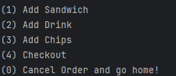
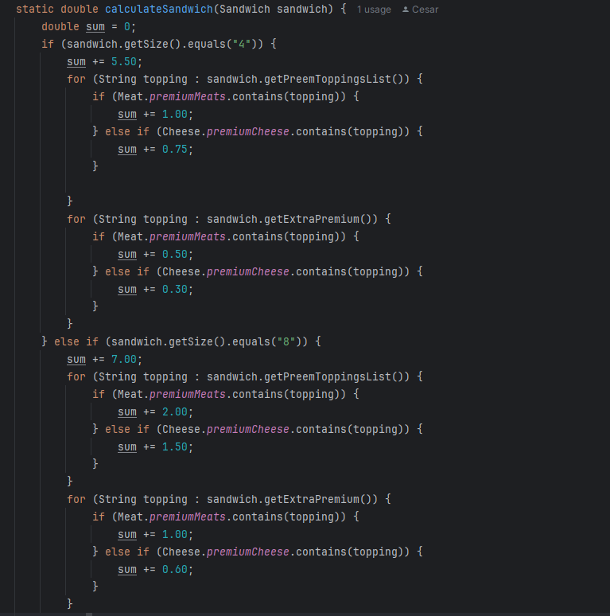

# Capstone-2-Deli_Cious_Sandwiches
___
 This application was constructed in Java and is meant to make orders for a Deli style sandwich shop. It contains multiple menus to be able to order a sandwich with a variety of toppings and the options to order a drink and chips aswell.
This is my second project in my capstone series where I implement methods and ideas I have learned so far in Java.
I hope you enjoy!
 ___
## Diagram
This diagram is what I used to think about how I can approach this project.

___

## Start Screen
___
The start screen contains only two options, Starting a new order and exiting the program.
This code leads into my order screen
___
## Order Screen
This screen allows the user to pick between 5 options including a way to cancel their order if necessary. All they must do
is enter the number that corresponds to the action they want, and it leads into questions regarding their choice.

___
## Favorite Piece of code
This chunk of code was the hardest part for me to code about the project. For day's I built around this as I didn't know
how to implement the prices for the sandwich. It took the help of my great teacher Maaike to literally just tell me to 
make some IF statements, and it clicked for me. Thanks for being the rubber ducky Maaike!

___
